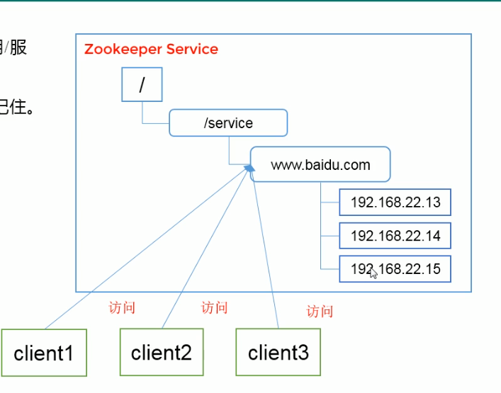

# ZooKeeper

## 概述

Zookeeper 是一个开源 `分布式`的，为分布式应用提供协调服务的Apache项目。
Zookeeper 从设计模式的角度理解：是一个基于 观察者模式设计的分布式服务管理框架
它 `负责存储和管理大家都关心的数据`, 然后`接受观察者的注册`，一旦这些数据的状态发生变化，
Zookeeper 就将负责通知已经在 Zookeeper 上注册的那些观察者做出相应的反应。

## 简单原理

1. 服务端启动时候去注册信息
2. 客户端获取当前在线的服务器列表，并且注册监听
3. 假如 某个服务器节点下线，
4. 客户端会受到 服务器节点下线的时间通知
5. process 重新再去获取服务器列表，并注册监听。

Zookeeper = 文件系统 + 通知机制

## 特点
1. 集群 一个Leader， 多个 Follower
2. 集群中只要半数以上节点存活，Zookeeper集训就能正常服务
3. 全局数据一致：每个Server保存一份相同的数据副本，Client无论链接到哪个Server,
数据都是一致的
4. 更新请求顺序执行，来自同一个Client的更新请求按其发送顺序执行
5. 数据更新的原子性
6. 实时性，在一定时间范围内，Client能读到最新的数据

## 数据结构

ZK 的数据结构与 Unix 文件相似，每个节点 称作 ZNode,每个 ZNode 默认存储 `1M`的数据。
每个ZNode通过路径唯一标识

## 应用场景

提供服务： 统一命名服务，统一配置服务，统一集群管理，服务器节点动态上下线，负载均衡等。

1. 统一命名服务：在分布式环境下，经常需要对服务器进行统一命名，便于识别，IP不容易记忆。

2. 统一配置服务： 分布式环境下，配置文件同步非常常见。
    - 一般要求一个集群中，所有节点中的配置是一致的，例如 Kafka集群
    - 对于配置文件修改后，能够快速同步到各个节点上

    配置管理交给 zk实现
    - 可以将 配置信息写入 zk的一个ZNode上
    - 各个客户端服务器监听这个 ZNode
    - 一旦 ZNode配置修改，ZK将通知各个服务器节点

## 统一节点管理

- 分布式环境中，可以实时监控节点的状态，将节点信息写入 ZK的一个ZNode
- 监听这个 ZNode 就可以监控这个节点的变化
- 客户端能实时洞察到服务器的上下线变化

## 软负载均衡

在 ZK中记录每台机器的访问数，让访问数最小的处理最近的客户端请求。

## 安装

[地址](https://apache.org/dist/zookeeper/zookeeper-3.4.14/)